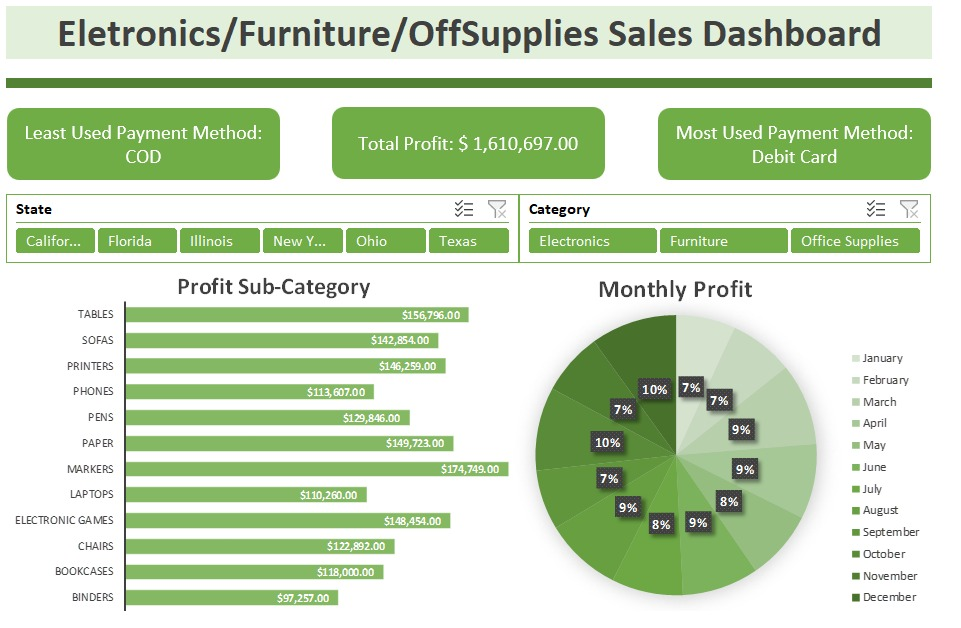

# 📊 EFO Sales Excel Dashboard

  

  
  
  

---

# 🇧🇷 Português

## 🎯 Objetivo

Dashboard interativo desenvolvido no Microsoft Excel para análise de vendas, lucros, categorias de produtos e métodos de pagamento.

O projeto foi criado com foco em visualização de dados, construção de KPIs dinâmicos e análise de performance comercial utilizando recursos intermediários e avançados do Excel.

---

## 📈 KPIs Desenvolvidos

- 💰 Lucro Total
- 💳 Método de Pagamento Mais Utilizado
- 📉 Método de Pagamento Menos Utilizado

Os KPIs foram construídos utilizando fórmulas dinâmicas com `ÍNDICE + CORRESP` para atualização automática baseada nos filtros aplicados.

---

## 🛠 Habilidades Demonstradas

- Dashboards Interativos
- Tabelas Dinâmicas
- Gráficos Dinâmicos
- Segmentação de Dados (Slicers)
- Fórmulas Avançadas
- ÍNDICE + CORRESP
- Análise de Dados
- Visualização de Dados
- Design de Dashboard
- Formatação Condicional

---

## 📊 Funcionalidades do Dashboard

### 🔹 Filtros Interativos
- Estado
- Categoria de Produto

### 🔹 Visualizações
- Lucro por Subcategoria
- Distribuição Mensal de Lucro
- KPIs Dinâmicos

---

## ⚙️ Ferramentas Utilizadas

- Microsoft Excel
- Pivot Tables
- Pivot Charts
- Slicers
- ÍNDICE + CORRESP
- Formatação Condicional

---

## 📂 Dataset

O dataset contém dados fictícios de vendas, incluindo:
- Categorias de produtos
- Subcategorias
- Lucro
- Métodos de pagamento
- Estados
- Dados mensais de vendas

---

# 🇺🇸 English

## 🎯 Objective

Interactive dashboard developed in Microsoft Excel for sales, profit, product category and payment method analysis.

This project was built focusing on data visualization, dynamic KPI creation and business performance analysis using intermediate and advanced Excel features.

---

## 📈 Developed KPIs

- 💰 Total Profit
- 💳 Most Used Payment Method
- 📉 Least Used Payment Method

The KPIs were created using dynamic `INDEX + MATCH` formulas for automatic updates based on applied filters.

---

## 🛠 Skills Demonstrated

- Interactive Dashboards
- Pivot Tables
- Pivot Charts
- Data Slicers
- Advanced Formulas
- INDEX + MATCH
- Data Analysis
- Data Visualization
- Dashboard Design
- Conditional Formatting

---

## 📊 Dashboard Features

### 🔹 Interactive Filters
- State
- Product Category

### 🔹 Visualizations
- Profit by Sub-Category
- Monthly Profit Distribution
- Dynamic KPIs

---

## ⚙️ Tools Used

- Microsoft Excel
- Pivot Tables
- Pivot Charts
- Slicers
- INDEX + MATCH
- Conditional Formatting

---

## 📂 Dataset

The dataset contains fictional sales data including:
- Product categories
- Sub-categories
- Profit
- Payment methods
- States
- Monthly sales information

---

# 🚀 Future Improvements

- Power Query automation
- Power Pivot integration
- Year-over-Year analysis
- Dynamic ranking system
- Additional business KPIs

---

## 👨‍💻 Author

### Marcelo Pereira

---

# 📚 Dataset Reference | Referência do Dataset

🇺🇸 Dataset used in this project was provided by:

🔗 https://www.kaggle.com/datasets/shantanugarg274/sales-dataset

Special thanks to the dataset creator for making the data publicly available for analysis and educational purposes.

---

🇧🇷 O dataset utilizado neste projeto foi disponibilizado por:

🔗 https://www.kaggle.com/datasets/shantanugarg274/sales-dataset

Agradecimentos ao criador do dataset por disponibilizar os dados publicamente para fins educacionais e analíticos.

---
